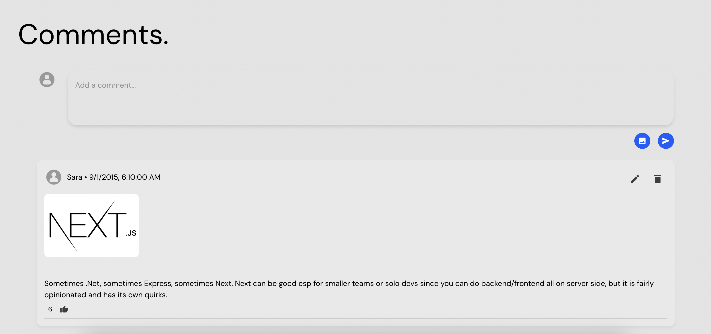

# bobyard-frontend-engineer

Simple comments log with GET (all), POST, PUT, and DELETE endpoints.

## Notes
### Design
**Color palette & font inspired by https://www.bobyard.com/blogs**

Color Palette

* <span style="color:#0f5cfb">Blue (#0f5cfb)</span>
* <span style="color:#eae9e9">Gray #1 (#eae9e9)</span>
* <span style="color:#e4e4e4">Gray #2 (#e4e4e4)</span>

Font Style
* DM Sans

Additional notes:
* Rounded corner for softer look analogous to Bobyard's blogs page
* Utilized Material UI components for cohensive and clean look
* Additional references: Youtube and Reddit comment sections
* Assumption: article above, with this comment component at the bottom of page (hence most recent comment at top)

### Time Dedication Breakdown
* ~1 hour: environment/file setup & design study
* ~2-3 hours: coding & debugging
* ~1 hour: documentation (comments & README)

### Future Improvements
***Features (UX, Frontend)***
* Reponsive Design: make the layouts of each device differ a little for better accessibility and navigation (UX)
* Filter (sort by date or likes)
* Replies
* Click to expand photo
* Comment hover effect, creation/deletion animation
* Error handling user side (error messages)

***Functionality and Security (Backend)***
* Unit Testing
* Authentication (e.g., can only edit your comments)
* Modularization of directory tree (difficult to scale if all content in same file)
* Functioning like button (make it so each user can only like a comment once, requires authentication)

### Key Files
***Frontend***
* **client/App.jsx**: main frontend file, where main React Comments component lives, makes calls to endpoints and DOM tree defined here

***Backend***
* **server/index.js**: main backend file, where GET, POST, PUT, and DELETE SQL statement functions & endpoint routes are defined 
* **server/openapi.yaml**: endpoint schemas
* **server/setup.js**: database user and database creation
* **server/init-table.js**: create Comments table
* **server/seed.js**: seed comments.json data into database


## Setup
### 1. Start the database (Docker)
Make sure your Docker app is open

From the project root:

```bash
docker compose up -d
```

Or with Docker Compose v2: `docker-compose up -d`

Wait a few seconds for Postgres to be ready, then continue.

### 2. Create DB user and database

Uses `server/.env` and connects as `postgres`/`postgres` (must match Docker):

```bash
cd server && node setup.js
```

### 3. Create the comments table (while in server directory)

```bash
node init-table.js
```

### 4. Seed data from comments.json (while in server directory)

```bash
node seed.js
```

### 5. Install dependencies

**Server:**

```bash
npm install && cd ..
```

**Client:**

```bash
cd client && npm install && cd ..
```

### 6. Start the server

```bash
cd server && node index.js
```

Leave this running. In another terminal...

### 7. Start the client

```bash
cd client && npm run dev
```

Frontend UI: http://localhost:5173

Server Endpoints UI AKA Swagger (Server/Backend): http://localhost:9000/api-docs

Client proxies API requests to http://localhost:9000

---
